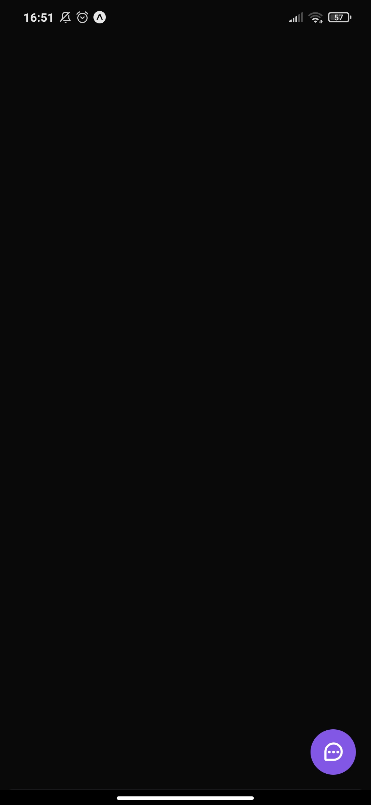
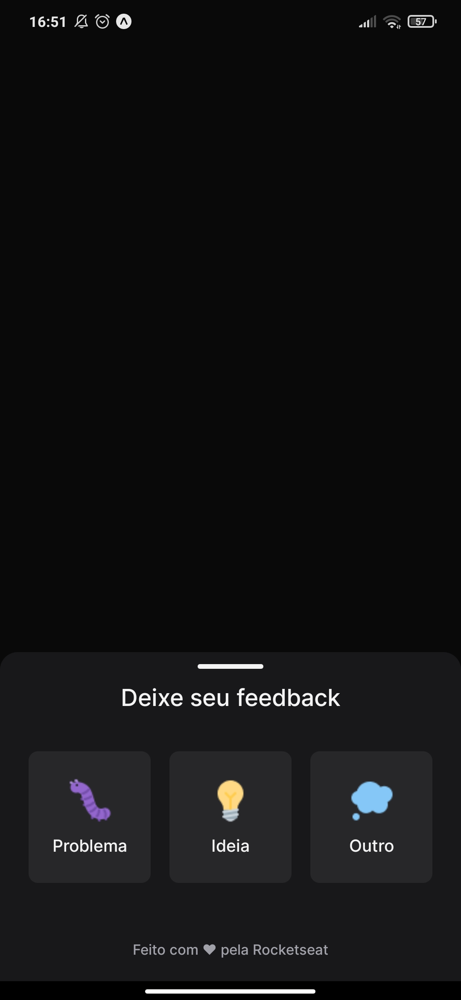
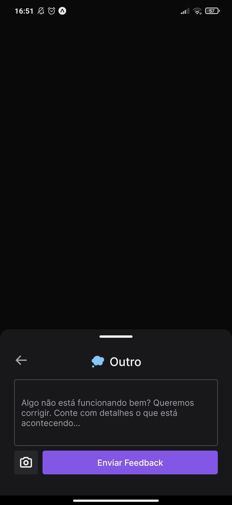
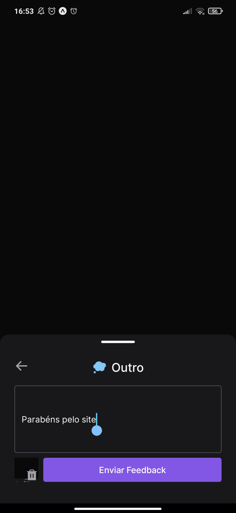
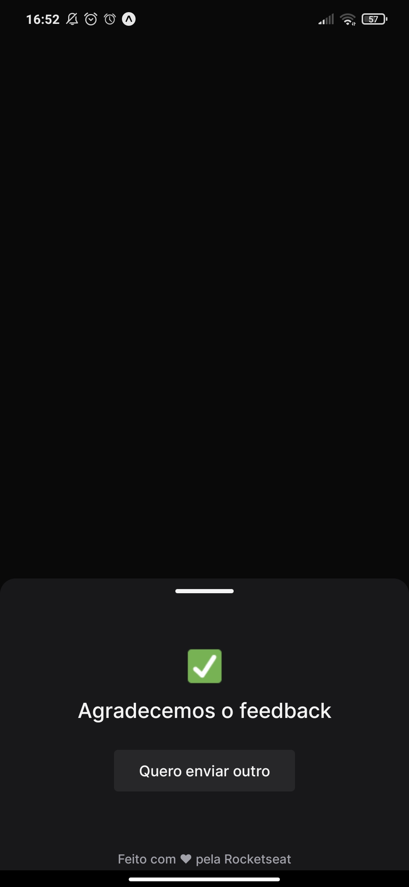

# FEEDWIDGET MOBILE

# Sobre o projeto

Widget capaz de enviar um feedback da aplicação. O widget envia um texto que deve relatar um problema, uma ideia ou bug. Também pode 
ser enviada uma foto do display no momento do feedback. 

Está é a versão mobile do FeedWidget para executar corretamente faça o clone do server deste repositório https://github.com/PauloCSantos/NLW-FeedWidget.git

### Explicação do sistema

- Na parte inferior direita da tela fica nosso widget esperando ser clicado para iniciar

- Quando pressionado ele mostra três opções para o feedback "Ideia", "Bug" e "Outros"

- Um ícone de camera pode ser pressionado para que o widget capture o display para ser enviado junto ao feedback

- Com o botão de enviar habilitado é só enviar o feedback e aguardar contato

### Tela inicial


### Opções de Feedback


### Ideia


### Ideia - preenchida


### Sucesso no envio


# 🚀 Começando

Essas instruções permitirão que você obtenha uma cópia do projeto em operação na sua máquina local para fins de desenvolvimento e teste.

## 📋 Pré-requisitos

- expo
- virtual device ou aplicativo expo no smartphone

## 🔧 Instalação
### :warning::warning: **A pasta imgs**: é para guardar as imagens usadas no readme.md! Apagar ela depois do clone :warning::warning:

``` bash
## clonar repositório
git clone https://github.com/PauloCSantos/NLW-FeedWidgetMobile.git

## no diretório mobile
- encontrar o arquivo api.ts no diretório libs
 preencher seu ip -> baseURL: "http://--seu ip aqui--:3333",

## entrar na pasta do projeto no terminal
cd mobile

## instalar as dependencias
expo install

## executar o projeto
expo start

## executar no app expo 
abrir o expo no celular e ler o qrcode

## executar no emulador
pressiona a para abrir no android
```

## 🛠️ Construído com

- Expo
- React Native
- TypeScript
- Phosphor react native
- Google Fonts
- Axios
- Gesture Handler

## ✒️ Autor

* **Paulo C Santos** - [Linkedin](https://www.linkedin.com/in/paulocsantos1995/)

## 🖐️ Agradecimento

Agradeço a RocketSeat, o NLW return foi um evento excelente com muito conteúdo prático e teórico.

- Link da RocketSeat: https://www.rocketseat.com.br/
